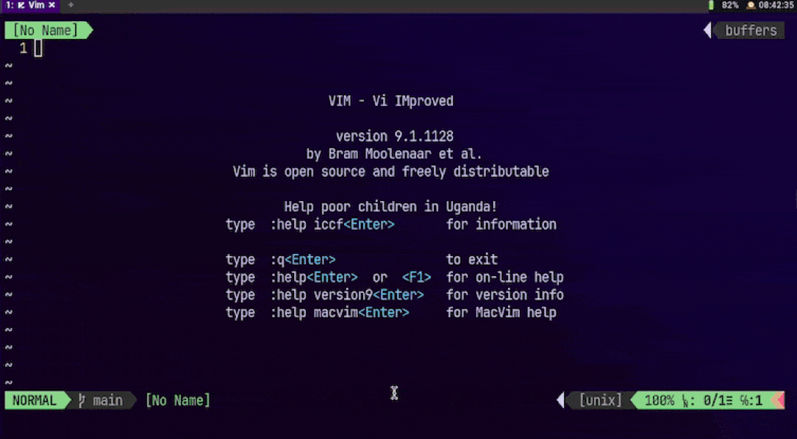

# vim-yazi

A Vim plugin that integrates the [yazi](https://github.com/sxyazi/yazi) terminal file manager with Vim/Neovim.

## Features

- 🚀 Launch yazi file manager from within Vim/Neovim
- 📁 Open selected files in Vim buffers automatically
- 🎯 Support for opening multiple files at once
- 🔄 Optional netrw replacement
- ⚡ Works with both Vim 8+ and Neovim



## Requirements

- Vim 8.0+ or Neovim 0.4+
- [yazi](https://github.com/sxyazi/yazi) installed and available in PATH

## Installation

### Using vim-plug

```vim
Plug 'yukimura1227/vim-yazi'
```

### Manual Installation

1. Download the plugin file
2. Place it in your Vim plugin directory:
   - Vim: `~/.vim/plugin/vim-yazi`
   - Neovim: `~/.config/nvim/plugin/vim-yazi`

## Usage

### Commands

| Command | Description |
|---------|-------------|
| `:Yazi [path]` | Launch yazi in the specified directory (defaults to current file's directory) |

### Default Key Mappings

| Key | Action |
|-----|--------|
| `<leader>y` | Launch yazi |

## Configuration

Add these options to your `.vimrc` or `init.vim` to customize the plugin:

```vim
" Path to yazi executable (default: 'yazi')
let g:yazi_executable = 'yazi'

" Enable opening multiple files (default: 1)
let g:yazi_open_multiple = 0

" Replace netrw with yazi (default: 0)
let g:yazi_replace_netrw = 1

" Disable default key mappings (default: 0)
let g:yazi_no_mappings = 1
```

### Custom Key Mappings

If you prefer custom key mappings, disable the defaults and define your own:

```vim
" Disable default mappings
let g:yazi_no_mappings = 1

" Define custom mappings
nnoremap <silent> <C-n> :Yazi<CR>
```

## How It Works

1. When you run a yazi command, the plugin launches yazi with a temporary file for storing selections
2. Navigate and select files in yazi (use `Space` to select, `Enter` to confirm)
3. Upon exiting yazi, the plugin reads the selection file and opens the chosen files in Vim
4. Multiple files are opened as separate buffers when `g:yazi_open_multiple` is enabled

## Examples

### Basic Usage

```vim
" Open yazi in current directory
:Yazi

" Open yazi in a specific directory
:Yazi ~/Documents
```

### Advanced Configuration

```vim
" Custom configuration example
let g:yazi_executable = '/usr/local/bin/yazi'
let g:yazi_replace_netrw = 1
let g:yazi_no_mappings = 1

" Custom key mappings
nnoremap <silent> <F2> :Yazi<CR>
```

## Troubleshooting

### Yazi not found

If you get an error about yazi not being found:

1. Make sure yazi is installed: `yazi --version`
2. Check if yazi is in your PATH: `which yazi`
3. Set the full path in your configuration: `let g:yazi_executable = '/full/path/to/yazi'`

### Files not opening

- Make sure you're selecting files in yazi with `Space` and confirming with `Enter`
- Check that the files you're selecting are readable
- Verify the temporary directory is writable

## Contributing

Contributions are welcome! Please feel free to submit issues, feature requests, or pull requests.

## License

This plugin is released under the MIT License. See [LICENSE](LICENSE) for details.

## Acknowledgments

- [yazi](https://github.com/sxyazi/yazi) - The blazingly fast terminal file manager
- Inspired by similar file manager integrations in the Vim ecosystem
